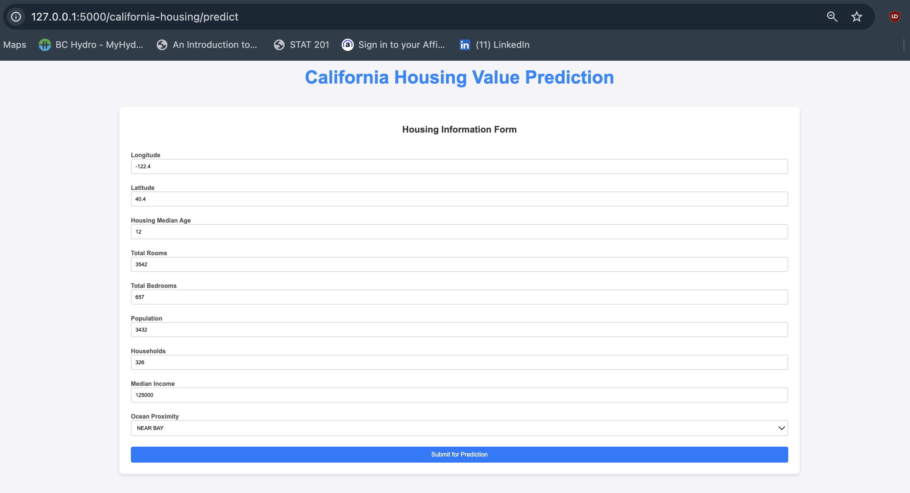
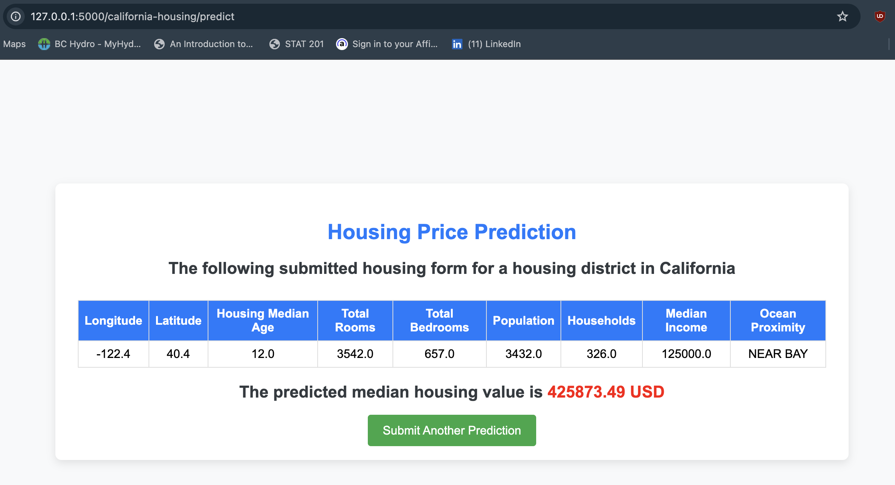

# California Housing Price Prediction

## Project Overview

This project demonstrates a complete machine learning pipeline, from data ingestion to model deployment. The goal is to predict the median housing value based on various features like housing median age, total rooms, population, etc., using a Flask web application for user interaction.

## Key Features

- **Automated Data Ingestion:** Automatically downloads a dataset from **_Kaggle_** using API calls and stores it as a CSV file locally. The data is also stored in **_MongoDB Atlas (NoSQL)_** for storage in cloud databases.
- **Data Preprocessing Pipeline:** The data preprocessing pipeline includes handling missing values, encoding categorical variables, scaling numerical features, and splitting the dataset into training and testing sets.
- **Model Selection using GridSearchCV:** Multiple machine learning models are trained and optimized using `GridSearchCV`. The best model is saved in a pickle file for future use.
- **Flask Web Application:** A user-friendly web interface built with **_HTML_** and **_CSS_** allows users to input features and receive predictions. The interface is designed to be intuitive and responsive, enhancing the user experience.
- **Cloud Deployment:** The project is designed for deployment on both **_Azure_** and **_AWS_** platforms, enabling scalable machine learning solutions.'

## Project Workflow

### 1. Data Ingestion
- **Kaggle API Integration:** The project automatically downloads the dataset from Kaggle using an API key.
- **Local and Cloud Storage:** After downloading, the data is saved locally as a CSV file and uploaded to MongoDB Atlas if it's not already stored there.

### 2. Data Preprocessing
The data preprocessing pipeline includes:
- Imputation
- Encoding categorical features (like `ocean_proximity`)
- Feature scaling
- Splitting data into training and testing sets

### 3. Model Training and Selection
- Multiple models are trained using `GridSearchCV` to find the best model for predicting the median house value in the districts of California.
- The selected model is then serialized and stored as a `.pkl` file, along with preprocessing, imputing, feature engineering and data transformation objects.

### 4. Web Application - HTML/CSS
The Flask web application provides an easy interface for users to input features and receive predictions.

* Users enter the housing data through a web form.
* After submitting the form, the model predicts the potential median housing value.
* A results page displays the prediction along with a button to submit a another query.

## Skills Demonstrated
* **Machine Learning:** Hands-on experience with various models, tuning hyperparameters using GridSearchCV, and model evaluation.
* **Data Science:** Automated data ingestion and preprocessing pipeline, handling large datasets, and integration with MongoDB Atlas.
* **Web Development:** Front-end development with HTML/CSS and back-end development using Flask.
* **Cloud Computing:** Cloud storage with MongoDB Atlas and deployment on Azure and AWS.
* **Automation:** End-to-end automation for data ingestion, preprocessing, model training, and deployment.

## Setup and Installation
### Prerequisites
* Python 3.11
* Anaconda or Miniconda Installed
* .env file with the following secret keys:
    ```
    # MongoDB secret keys
    MONGODB_USER_NAME=<your_mongo_username>
    MONGODB_PASSWORD=<your_mongo_passowrd>
    MONGO_DB_URI=<your_uri_for_mongo_cluster>
     
    # Kaggle Secret Keys (Source of the downloaded dataset)
    KAGGLE_DATASET="harrywang/housing"
    DATASET_PATH='./notebooks/data'
    ```
### Installation

#### Clone this repository:
```
git clone https://github.com/sohbatSandhu/california-housing-price-prediction.git
```

#### Create Conda or Python Environment

```
conda create -p venv python=3.11
```

#### Install the required packages and dependencies:

```
pip install -r requirements.txt
```
Set up the Kaggle API and MongoDB Atlas credentials.

## Model Training and Results

Run the following command in the root of the current workplace
```
python src/components/data_ingestion.py
```

### Model Metrics

Below are the best models and their corresponding training scores:

Model | Training Score
------|-----------------
Linear Regression | 0.6726
Ridge Regression | 0.6727
Decision Tree Regressor | 0.7078
Random Forest Regressor | 0.8066
Bagging Regressor | 0.8194
Gradient Boosting Regressor | 0.8335
AdaBoost Regressor | 0.6345
XGBoost Regressor | 0.8418

#### **Best model: XGBoost Regressor**

Training Score: _0.8418_

Test Score: _0.8158_

## Running the Web Application

### Start the Flask application:
```
python application.py
```

Access the web application at http://127.0.0.1:5000/california-housing/predict.

### Example Run



